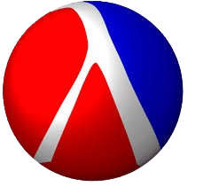
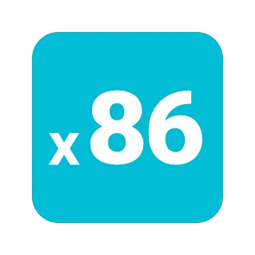

<!-- GOT THE INFO IMAGES FROM -> https://profile-readme-generator.com/ -->

## Hi there, I'm Nil 👋

I'm a Computer Science student at FIB-UPC in Barcelona.

### 📫 Contact 

  
  <!-- 
   -->

<!-- 

  

 -->

<!-- PacMan, not used right now

<!-- <picture>
  <source media="(prefers-color-scheme: dark)" srcset="https://raw.githubusercontent.com/nilhouses/nilhouses/output/pacman-contribution-graph-dark.svg">
  <source media="(prefers-color-scheme: light)" srcset="https://raw.githubusercontent.com/nilhouses/nilhouses/output/pacman-contribution-graph.svg">
  
</picture> -->

<!-- Languages -->

### 🛠 Programming Languages, Tools, and Libraries

#### 📜 Imperative & Object-Oriented Languages

  
  
  
  
  
  
  

#### 🧠 Logic & Declarative Languages

  
  
  
  
  <!-- 
   -->

#### 🐍 Multi-Paradigm Languages

  
  

#### 🧑‍💻 Functional Languages

  
  
  
  

#### ⚙️ Assembly and Syntax tools

  
  
  
  
  
  

#### 👁️ Graphics and Visualization

  
  
  
  

#### 🗃️ Databases and Analysis Tools

  
  
  

#### 📄 Documentation

  
  
  
    

#### 🔧 Version Control and Project Management Tools

  
  
  
  

#### 🎮 Game Development

  

<!-- [simple 2D game](https://nilcd.itch.io/projecte) -->

#### 💻 Operating Systems

  
  
  

<!-- 

### 🎧 Music [Listen on Spotify](https://open.spotify.com/playlist/37i9dQZF1EpjNe2LPGtZ96?si=TTK3BFgXRi2VfiAUKahj)
### 🎵 Recent songs listened to

